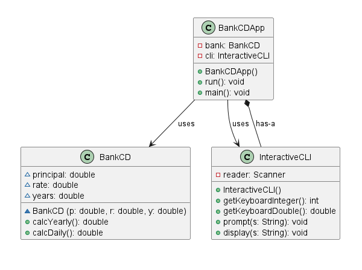
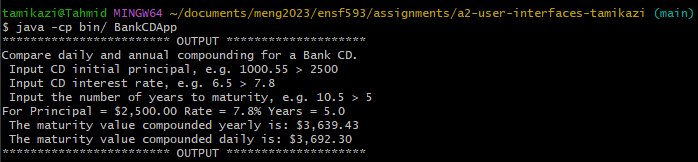

# Days in Month report
Author: Tahmid Kazi

## UML class diagram

## Execution and Testing

To run `src/BankCDApp.java` from command line, first compile with `javac -sourcepath src/ -d bin/ src/BankCDApp.java` and run with `java -cp bin/ BankCDApp`. The CLI will prompt you for responses for Principal, Interest Rate and time to Maturity one at a time. Input your desired values and hit enter to get the next prompt. After inputting the third and last prompt, you will see the calculated output. See screenshot below for an example terminal session.

Alternatively, in Eclipse, right-click on `BankCDApp.java` in the `Package Explorer` and select `Run As->Java Application`

 

# Reflection
I liked the GUI for this assignment and learning how to create these interfaces as there can be many applications using this as a foundation. The syntax is something that is challenging for me when learning new things in Java, however there are many resources available and reminders for syntax conventions and through practice I can see myself becoming more familiar.